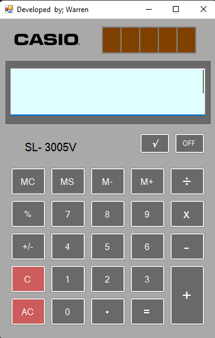
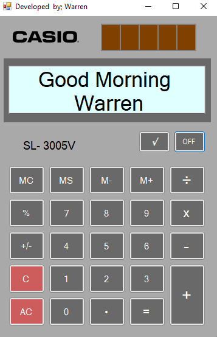
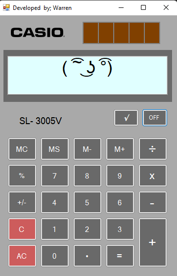
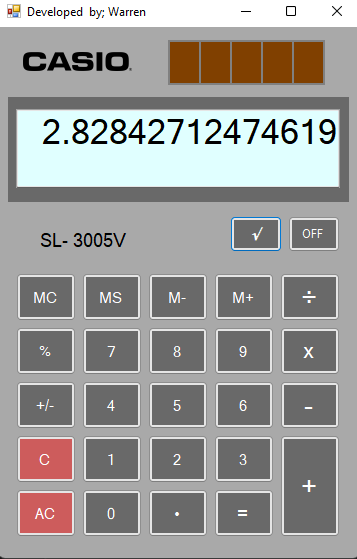

# Casio-Calculator-VB
This is my one of my project when I'm studying in college.\
This is fully functioning calculator and it has good design for me.\
To try it please dowload this repo after that open the folder VB example\bin\Debug and click the "VB example.exe" 

